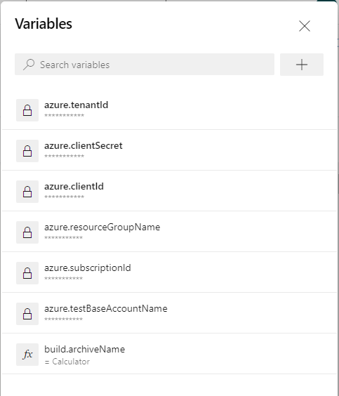

## CICD ADO sample
This sample demonstrates how to integrate Test Base into your CI/CD process using [Test Base REST API](https://docs.microsoft.com/en-us/rest/api/testbase/) and Azure DevOps [PowerShell Task](https://docs.microsoft.com/en-us/azure/devops/pipelines/tasks/utility/powershell?view=azure-devops).

### App under test
Calculator is a sample app which is being tested. Click [here](../../../Sample-App-Src/Calculator) for details of Calculator.

### Test Base Integration via ADO CI/CD
Before using the yml in ADO pipeline, set the following variables



2 workflows created to integrate with Test Base.
- delpoy-to-testbase.yml: Whenever there's a change on the app, this workflow will:
    - Build the app
    - Zip the package
    - Upload the package to Test Base and start test
- check-testbase-results.yml: Check if there's a failure in the last 24 hours.

There're 2 json files that contain request bodies for create/update package.
- PackageSetting.json, create or replace (overwrite/recreate, with potential downtime) a Test Base Package.[Details](https://docs.microsoft.com/en-us/rest/api/testbase/packages/create?tabs=HTTP#request-body)
- AppSetting.json, update an existing Test Base Package. [Details](https://docs.microsoft.com/en-us/rest/api/testbase/packages/update?tabs=HTTP#request-body)

### Using Test Base API by PowerShell
There're 2 PowerShell scripts demonstrate Test Base API usage.
- UpdatePackage.ps1 shows using Test Base REST API to upload a package, return 0 if the package is uploaded successfully, return 1 otherwise.
- CheckResults.ps1 shows how to list test summaries,
returns 0 if there was no test failure in the last 24 hours, and return -1 otherwise.

In order to run the PowerShell scripts, set the following environment variables. To obtain `subscription id`, `client id`, `client secret`, and `application id`, follow the instructions in [register a new application using Azure portal](https://docs.microsoft.com/en-us/azure/active-directory/develop/howto-create-service-principal-portal).

```
// The following are environment variables
$env:AZURE_SUBSCRIPTION_ID=<subscription id>
$env:AZURE_CLIENT_ID=<client id>
$env:AZURE_CLIENT_SECRET=<client secret>
$env:AZURE_TENANT_ID=<tenant id>
$env:RESOURCE_GROUP_NAME=<resource group name for test base account>
$env:TESTBASE_ACCOUNT_NAME=<test base account name>

// The following are only for UpdatePackage.ps1
applicationName=<application name in Test Base>
packageVersion=<application version in Test Base>
packagePath=<package file path, e.g., './Calculator.zip'>

e.g.,UpdatePackage.ps1 -applicationName <application name in Test Base> -packageVersion <application version in Test Base> -packagePath=<package file path>
```
